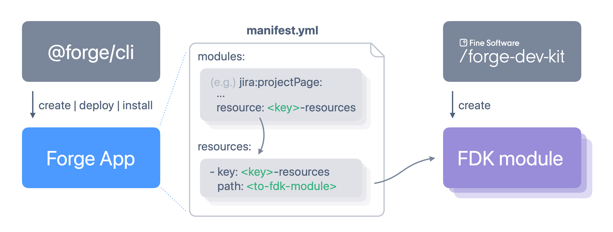
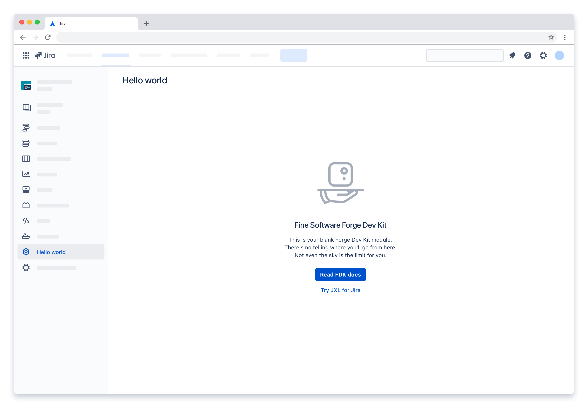

[](https://jxl.app)

<br><br>

<p align="center">
  
</p>

<br>

A zero-config toolkit for creating fine Forge apps.

# Background

The Forge Dev Kit (FDK) is a preconfigured set of libraries and frameworks for developing apps for Atlassian Jira - and soon, Confluence - with ease. The FDK builds on Atlassian Forge, TypeScript, React, Emotion, Next.js, and the Atlassian Design System, plus a number of libraries to glue it all together.

FDK doesn't replace the standard Forge tooling; it instead simplifies the creation of [Custom UI](https://developer.atlassian.com/platform/forge/custom-ui/)-based modules, which can then be used within any (new or existing) Forge app.

<p align="center">
  
</p>


# Getting started

## Requirements

Before getting started, make sure that [Forge is set up for development](https://developer.atlassian.com/platform/forge/getting-started/).

## Creating your FDK module

Create a new FDK module by running

``` console
npx @finesoftware/forge-dev-kit create
```

In the wizard that follows, chose the `Hello world` template, and read through any instructions carefully.

## Updating your Forge app

If you don't have a Forge app yet, [create one using the Forge CLI](https://developer.atlassian.com/platform/forge/build-a-hello-world-app-in-jira/#create-your-app).

In your Forge app's `manifest.yml`, find or create a new `module`, of a type that supports Forge's Custom UI (such as `jira:projectPage`). In the module's `resources`, point to the FDK module's `out` directory, like so:

``` diff
modules:
+  jira:projectPage:
+    - key: hello-world
+      title: Hello world
+      resource: hello-world-resource

resources:
+  - key: hello-world-resource
+    path: ../hello-world/out
```

Also make sure that your `manifest.yml` includes the following `permissions`:

``` diff
permissions:
+   content:
+       styles:
+         - 'unsafe-inline'
+       scripts:
+         - 'unsafe-eval'
```

## Starting your Forge app

In your Forge app's base directory, run

``` console
forge deploy
forge install --upgrade
```

Voilà! You should now see your FDK-based _Hello world_ app in action - in this case, using a module of type `jira:projectPage`:

<p align="center">
  
</p>

## Making your first change

To make a change to the _Hello world_ module, open the module directory in an IDE of your choice (Visual Studio Code will work great), and navigate to the `src/index.tsx` file. This file is the entry point to your module. In `src/index.tsx`, you will see the React code behind _Hello world_. Make a small change to it - for example, change the `h3` text, like so ...

``` diff
- <h3>Fine Software Forge Dev Kit</h3>
+ <h3>G'day!</h3>
```

... or write any other valid React code. Just keep exporting a React component as the file's `default export` - that's expected and required by FDK.

Next, in the root directory of your module, run

``` console
yarn run generate
```

This will compile your code, and generate the static resources into the `out` directory.

Next, navigate to your Forge app's root folder, and run

``` console
forge deploy
```

When you reload Jira in your browser, you should now see your changes live.

## Setting up your inner dev loop

You already deployed a change to your Forge app - well done! However, as you start making more comprehensive changes, you don't want to go through the hassle of `generate` + `deploy` all the time. Luckily, FDK plays well with Forge's [tunneling](https://developer.atlassian.com/platform/forge/tunneling/) capabilities.

First, in your module's root directory, run

``` console
yarn run dev
```

to start your module's `next.js` development server. By default, it is running on port `3000`.

Next, navigate in your Forge app's `manifest.yml`, and modify your module resource definition, like so:


``` diff
resources:
  - key: hello-world-resource
    path: ../hello-world/out
+   tunnel:
+     port: 3000
```

... where `3000` is the port that your dev server is running on.

Next, start your app in tunneling mode, using

``` console
forge tunnel
```

You can now go on to make further changes to your module, and simply reload Jira to view them live.

# Guides

- [Understanding your FDK module](./documentation/guides/01-understanding-your-fdk-module.md)
- [Recommended project structure](./documentation/guides/02-recommended-project-structure.md)
- [Accessing your module's _context_](./documentation/guides/03-accessing-your-modules-context.md)
- [Fetching data from Jira](./documentation/guides/04-fetching-data-from-jira.md)
- [Updating data in Jira](./documentation/guides/05-updating-data-in-jira.md)
- [Navigating in Jira](./documentation/guides/06-navigating-in-jira.md)

<br><br>

[](https://jxl.app)
