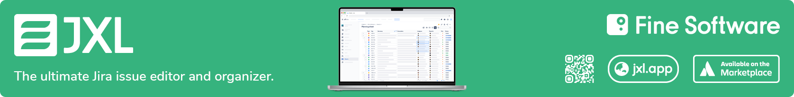
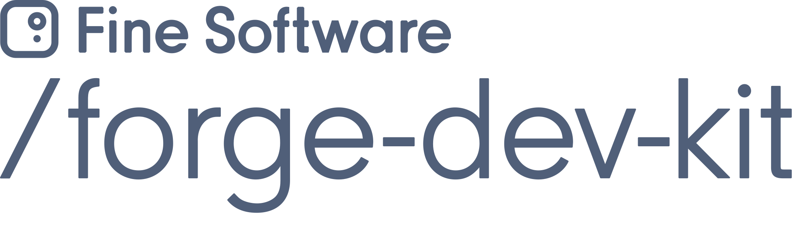
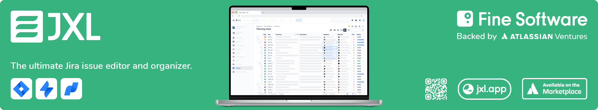

[](https://jxl.app)

<br><br>

<p align="center">
  <a href="../../README.md">
    
  </a>
</p>

<br>

⤴️ [Back to quickstart](.../../README.md)

# Fetching data from Jira

There's a high chance that your app will want to load and render data from the Jira site it is installed into. The Forge Dev Kit offers two ways of doing this: A [Hook](https://reactjs.org/docs/hooks-intro.html)-based API specifically for React, and a framework-agnostic, `Promise`-based API to be used wherever a hook-based API is too opinionated.

## Hook-based API

FDK provides a hook-based abstraction for all `GET` requests of the [Jira REST API v3](https://developer.atlassian.com/cloud/jira/platform/rest/v3/intro/) through `@finesoftware/react-forge-jira`. E.g., the issues of fix version `v1` can be loaded like so:

``` js
import { useContext } from '@finesoftware/react-forge-jira`;

export default () => {
    const { data: issues, error } = useIssues({ jql: 'fixVersion = v1' });

    if (!issues) {
        return <span>Loading...</span>;
    }

    return <span>{issues.issues.length} issues found</span>;
}
```

Similar hooks are available, e.g., for `useProjects`, `usePriorities`, and many other requests. All of these hooks are fully typed, meaning that you can rely on code completion and type checking.

As you can see above, these REST hooks are asyncronous in nature, meaning that `data` (or, if anything goes wrong, `error`) are available only after the request is finished. You may want to show some kind of loading indication until a result is ready to be shown.

FDK's hook-based API is based on [SWR](https://swr.vercel.app/). All [SWR options](https://swr.vercel.app/docs/options) (except for `fetcher`) can be passed as an optional second argument, e.g. like so:

``` js
useIssues({ jql: 'fixVersion = v1' }, { shouldRetryOnError: false  });
```

In addition to the standard SWR options, a `skip` flag can be provided to enable [conditional fetching](https://swr.vercel.app/docs/conditional-fetching).

``` js
useIssues({ jql: 'fixVersion = v1' }, { skip: true  });
```

Please refer to the [SWR documentation](https://swr.vercel.app) for the full API reference and usage patterns.

## Promise-based API

FDK's hook-based API is an abstraction around the promise-based `@finesoftware/forge-jira-api`. In scenarios where hooks don't work, you can use this promise-based API directly, like so:

``` js
import { getIssues } from '@finesoftware/forge-jira-api`;

const getV1Issues = async () => {
    const issues = await getIssues({ jql: 'fixVersion = v1' })
    console.log(`${issues.issues.length} issues found`);
}
```

As for the hook-based API, all requests of the promise-based API are full typed. The promise-based API also contains various requests for _updating_ Jira data, as discussed in the next section.

:warning: FDK's Jira APIs are not complete, however more requests will be added in the future. If you require additional requests or type definitions (or find a bug), please [raise an issue](https://github.com/finesoftware/forge-dev-kit/issues). For API references, please refer to [`@finesoftware/forge-jira-api`](../../packages/forge-jira-api/README.md) and [`@finesoftware/react-forge-jira`](../../packages/react-forge-jira/README.md).


⏮ Previous: [Accessing your module's _context_](./03-accessing-your-modules-context.md)

⏭ Next: [Updating data in Jira](./05-updating-data-in-jira.md)

<br><br>

[](https://jxl.app)
